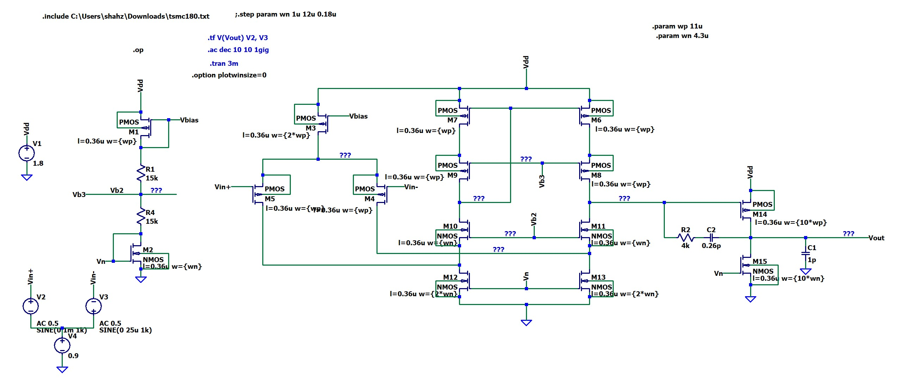
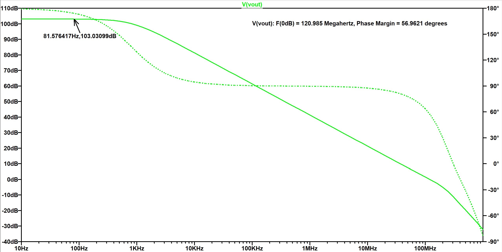

# Two-Stage Folded Cascode Op-Amp
**Topology:** PMOS-Input Folded Cascode (Stage 1) + Common Source (Stage 2)
**Technology:** 180nm CMOS | **Tool:** LTspice

## Project Overview
This design implements a high-performance operational amplifier combining a **Folded Cascode** first stage with a **Class-A Common Source** second stage.
* **Why Folded Cascode?** Selected to maximize DC gain (achieving >100dB) while maintaining better input common-mode range than telescopic architectures.
* **Biasing:** Features an on-chip bias generation network (Constant-Gm/Voltage Divider) to provide stable reference voltages (Vb2, Vb3, Vn) for the cascode stack.

## Technical Specifications
| Parameter | Value |
| :--- | :--- |
| **Supply Voltage** | 1.8 V |
| **DC Gain** | **103.0 dB** |
| **Unity Gain Bandwidth** | **121 MHz** |
| **Phase Margin** | **57°** |
| **Power Consumption** | **545 µW** |
| **Load Capacitance** | 1 pF |

## Schematic Design

## Simulation Results
### 1. AC Analysis (Bode Plot)
The frequency response validates the ultra-high gain performance.
* **Gain:** 103.03 dB
* **UGB:** 120.9 MHz
* **Phase Margin:** 56.96°

