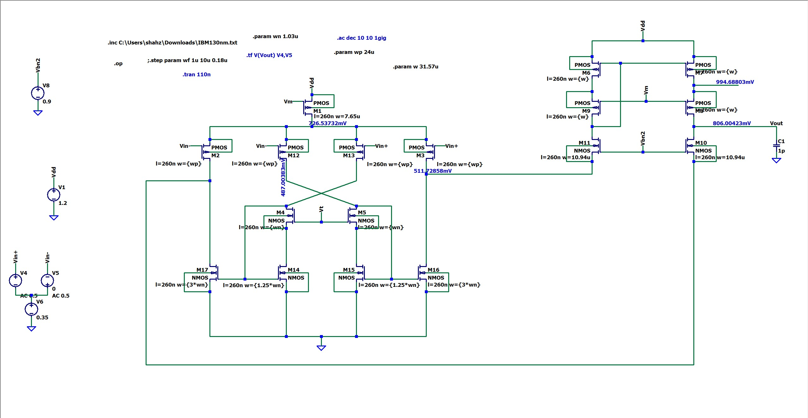
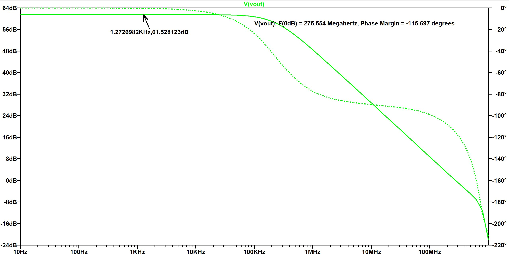

# Recyclic Folded Cascode Operational Amplifier (OTA)

## 📌 Project Overview
This repository contains the design and simulation of a **Recycling Folded Cascode (RFC) Operational Transconductance Amplifier**. The design is implemented in **130nm CMOS technology** using **LTspice**.

The primary goal of this design is to enhance the transconductance ($g_m$), DC gain, and Gain-Bandwidth Product (GBW) compared to a conventional folded cascode topology, without increasing power consumption.

## 📊 Key Specifications
*Performance metrics extracted from AC analysis with $V_{DD} = 1.2V$ and $C_L = 1pF$.*

| Parameter | Value | Unit |
| :--- | :--- | :--- |
| **Technology Node** | 130 | nm |
| **Supply Voltage** | 1.2 | V |
| **Power Dissipation** | **236** | **µW** |
| **DC Gain** | 61.53 | dB |
| **Unity Gain Bandwidth** | 275.6 | MHz |
| **Phase Margin** | 64.3 | Degrees |
| **Load Capacitance** | 1 | pF |

## 🔌 Circuit Topology
The **Recycling Folded Cascode** architecture modifies the standard folded cascode by splitting the input differential pair and using current mirrors with a specific gain ratio.

### Advantages over Conventional Folded Cascode:
1.  **Enhanced Transconductance:** The "recycling" mirrors boost the effective $g_m$ of the input drivers, increasing the GBW.
2.  **Higher Slew Rate:** Improved current drive capability for the same static power budget.
3.  **Power Efficiency:** Achieves better performance metrics for the same bias current (236 µW total static power).


*Fig 1: LTspice Schematic showing parameterized width sizing (`wp`, `wn`) and biasing network.*

## 📈 Simulation Results
### AC Analysis
The frequency response confirms stable operation with a healthy phase margin.
* **Low Frequency Gain:** ~61.5 dB
* **0dB Crossover:** ~275.6 MHz
* **Stability:** The phase at crossover is -115.7°, resulting in a **Phase Margin of 64.3°** ($180^\circ - 115.7^\circ$).


*Fig 2: Bode Plot showing Magnitude (solid line) and Phase (dotted line).*

## 🛠️ Tools & Models used
* **Simulator:** LTspice XVII
* **Model File:** 130nm CMOS
* **Design Parameters:**
    * PMOS Input Width ($W_p$): $24\mu m$
    * NMOS Base Width ($W_n$): $1.03\mu m$

## 🚀 How to Run
1.  **Clone the repository:**
    ```bash
    git clone [https://github.com/shahzad4578/Recyclic_Folded_Cascode.git](https://github.com/shahzad4578/Recyclic_Folded_Cascode.git)
    ```
2.  **Setup LTspice:**
    * Ensure the CMOS 130nm model file is located in the same directory as the `.asc` file or update the `.inc` directive in the schematic.
3.  **Run Simulation:**
    * Open `Recyclic_Folded_Cascode.asc` in LTspice.
    * Click **Run**.
    * Select the `V(vout)` node to view the Bode plot.

## 📂 File Structure
* `Recyclic_Folded_Cascode.asc` - Main LTspice schematic file.
* `AC_Analysis.jpg` - Plot of Gain and Phase.
* `README.md` - Project documentation.

---
*Project by [Shahzad Ahmad]*
