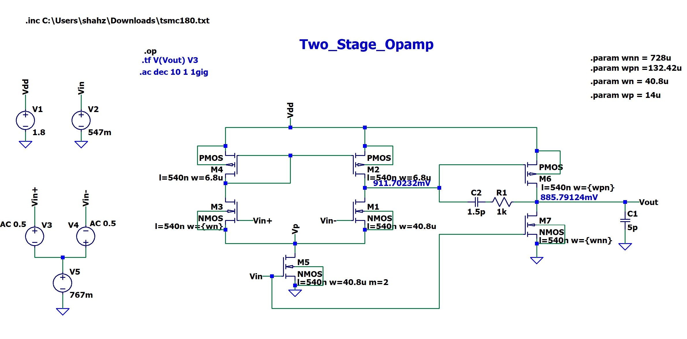
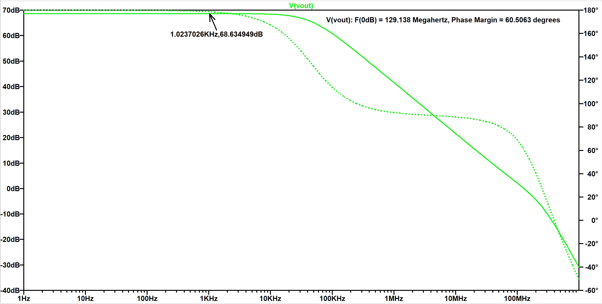

# Two-Stage Operational Amplifier
**Technology:** 180nm CMOS | **Tool:** LTspice

## Project Description
A classic two-stage Operational Transconductance Amplifier (OTA) topology designed for general-purpose signal conditioning. This design ensures high DC gain while maintaining stability across a wide bandwidth.

## Technical Specifications
| Parameter | Target | Achieved |
| :--- | :--- | :--- |
| **DC Gain** | > 60 dB | **68.6 dB** |
| **Unity Gain Bandwidth** | > 50 MHz | **129.1 MHz** |
| **Phase Margin** | 45° - 70° | **60.5°** |
| **Load Capacitance** | 5 pF | **5 pF** |

## Schematic Design
*(Make sure you upload your schematic image and name it exactly 'OpAmp_Schematic.jpg')*

## Simulation Results
### 1. AC Analysis (Bode Plot)
The simulation validates the frequency response, confirming a stable phase margin of **60.5°**.

